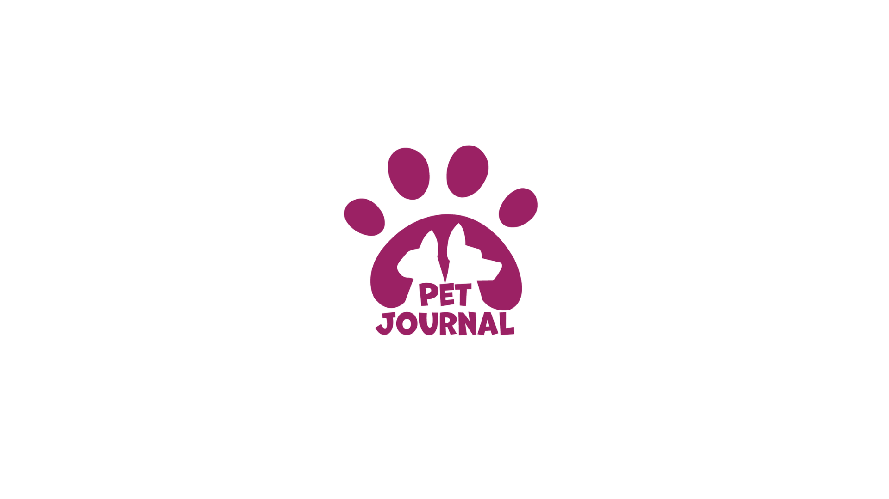

# PetJournal 

Desenvolvimento de um produto para registro de informações referentes aos nossos pets. Registrando informações relevantes como datas de vacinas, datas em que foi aplicado vermífugo com detalhes, histórico de compras de ração, integração com Google Agenda, etc.

### Sumário: 
 - [Repositórios](#repositorios)
 - [Membros](#membros)

#### Membros
- Founder [Danrley Pires](https://www.linkedin.com/in/dansenpir/)
- Mentor [Danrley Pires](https://www.linkedin.com/in/dansenpir/) | [Nelson Junior](https://www.linkedin.com/in/juniormargalho/)
- Product Mannager [Mariana de Brito](https://www.linkedin.com/in/mari-brito/) | [Tamires Akemi](https://www.linkedin.com/in/tamireskojima/)
- Scrum Master [Letícia Tavares](https://www.linkedin.com/in/leticiatrandrade/)
- UX/UI [Cleverson Antonietti](https://www.linkedin.com/in/cleversonantonietti/) | [Diego Victor Martiliano](https://www.linkedin.com/in/diegovictormartiliano/) | [Leonardo da Silva](http://linkedin.com/in/leonardo-m-silva/) 
- Desenvolvimento 
   - Backend [Matheus Gondra](https://www.linkedin.com/in/matheus-gondra-a187a81a3/) | [Rodrigo Meneses](https://www.linkedin.com/in/rodrigofmeneses/) | [Samuel Silva](https://www.linkedin.com/in/samuel-silva-2a4893217/)
   - Frontend [Larissa Oliveira](https://www.linkedin.com/in/larissa-oliveira-a04611238/) | [Leonardo Teixeira](https://www.linkedin.com/in/leotx) | [Mateus Carvalho](https://www.linkedin.com/in/mateuscarvalhodev/)
   - Android [Gelson de Souza](https://www.linkedin.com/in/gelsonsouza) | [Gustavo oliveira](https://www.linkedin.com/in/gusoliveira21/) | [Leonardo Santos](https://www.linkedin.com/in/leozinhozd/)
   - IOS [Daiane dos Santos](https://www.linkedin.com/in/daigoncalves/) | [Marcylene Souza](https://www.linkedin.com/in/marcylene-barreto/)
- Quality Assunrance (QA) [Nicolas Targino](https://www.linkedin.com/in/nicolas-targino/) | [Daniela Cardoso](https://www.linkedin.com/in/daniela-cardoso-da-silva-b25587234/?trk=contact-info)

#### Repositórios 

